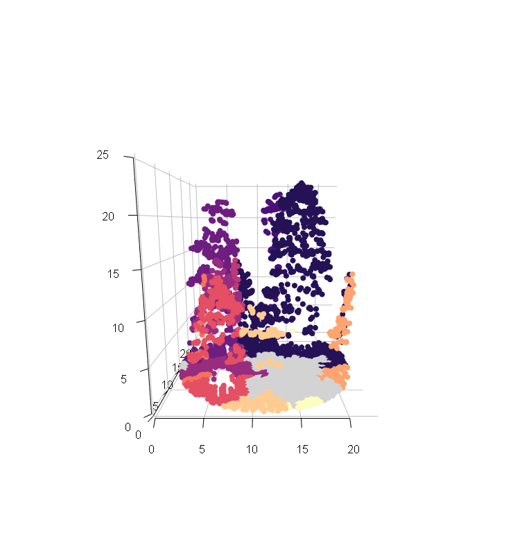

```{r, include = FALSE}
library(rgl)
library(knitr)
```


A package to be used in conjuction with lidR (https://github.com/Jean-Romain/lidR) that produces area-based variables. Newer functions focus on the use of tree- and voxel-based attributes. These approaches are further outlined in Blackburn et al. 2021 (https://cdnsciencepub.com/doi/10.1139/cjfr-2020-0506). Below are some examples:

### Install package

```{r, results = FALSE}
# devtools::install_github("RCBlackburn/lidRattR")
```

### Load in library and example data from lidR package

```{r, warning = FALSE}
library(lidR)
library(lidRattR)
library(data.table)
LASfile <- system.file("extdata", "Megaplot.laz", package="lidR")
las <- readLAS(LASfile)
las <- filter_poi(las, Classification != LASNOISE)
las <- normalize_height(las, knnidw(k = 8, p = 2))
las <- filter_poi(las, Z < 50 & Z >= 1.37 )
las <- decimate_points(las, random_per_voxel(res = 1, n = 8))
```


## Tree-based approach

<p align="center">

</p>

The tree based approach summarizes individual tree based information to a given area (e.g., plot, pixel).

First, We segment the trees using a tree segmentation function from lidR. Here, we use the Li et al. 2012 algorithm.

```{r}
las_tree <- segment_trees(las, li2012())
plot(las_tree, color = "treeID")
```

<p align="center">

</p>

Next, we can turn the segmented tree point cloud into a summary statistics of tree attributes to either the extent of the point cloud or within individual raster cells (resolution defined by rast_res). 

```{r, fig.asp= .5}
## entire las summary statistics 
tree_metrics <- tree_summary(las_tree)
kable(tree_metrics)

## rasterized summary statistics 
tree_metrics <- tree_raster(las_tree, rast_res = 20)
plot(tree_metrics)
```

## Voxel-based approach

<p align="center">

</p>

The voxel-based approach voxelizes the point cloud and summarizes voxel information across a given area. This allows voxel-based variables to be assessed using an area-based approach. 

Using these functions, we produce summary statistics of voxel attributes to either the entire las or within individual raster cells (resolution defined by rast_res). These attributes can be computed without defining a specified maximum height for the analysis (max_z = NULL) or setting a maximum height that must be larger than the highest Z value in the study area. Applicability of certain voxel attributes depends on raster and voxel resolution. 

```{r, fig.asp= .5}
## entire las summary statistics 
voxel_metrics <- voxel_summary(las, vox_res = 2, max_z = 50)
kable(voxel_metrics)

## rasterized summary statistics  
voxel_metrics <- voxel_raster(las, vox_res = 2, rast_res = 20, max_z = 50)
plot(voxel_metrics)
```

