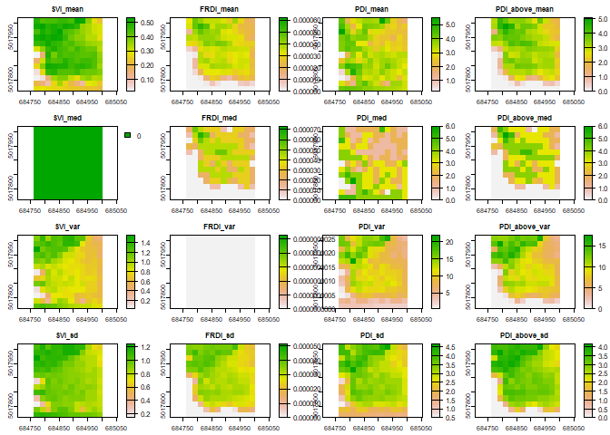

lidRmts
================

#### A package to be used in conjuction with lidR (<https://github.com/Jean-Romain/lidR>) that produces area-based varaibles for the voxel based approach. Additional scripts for cloud and tree-based approaches were used in Blackburn et al. 2021 (<https://cdnsciencepub.com/doi/10.1139/cjfr-2020-0506>).

### Voxel-based apprach

 The voxel-based approach voxelizes the point cloud
and summarizes voxel information across a given area. This allows
voxel-based variables to be assessed using an area-based approach. This
packages main functions include `vox()`, `vox_sum()`, and `.vox_rater`.
An example of these functions being used can be seen below:

``` r
## install package and load library
# devtools::install_github("RCBlackburn/lidRmts")
library(lidR)
library(lidRmts)
```

    ## Warning: replacing previous import 'data.table::last' by 'dplyr::last' when
    ## loading 'lidRmts'

    ## Warning: replacing previous import 'data.table::first' by 'dplyr::first' when
    ## loading 'lidRmts'

    ## Warning: replacing previous import 'data.table::between' by 'dplyr::between'
    ## when loading 'lidRmts'

``` r
## read in example plot from lidR package
LASfile <- system.file("extdata", "Megaplot.laz", package="lidR")
las <- readLAS(LASfile)


## Run the voxelize function to produce a voxelized point cloud wiht indivdual voxel metrics
las_vox <- vox(las, res = 2)

## get summary statistics for voxelized point cloud
plot_metrics <- vox_sum(las_vox, 2)

## display the mean metrics
knitr::kable(plot_metrics[c(1:4, 33)])
```

| SVi_2\_mean | FRDi_2\_mean | PDi_2\_mean | PDi_above_2\_mean | pct_fill_vox_2 |
|------------:|-------------:|------------:|------------------:|---------------:|
|   0.3790793 |     3.08e-05 |    3.171619 |           2.51457 |      0.2001375 |

``` r
## summarize voxel metrics using lidR::pixelmetrics() with vox_sum_raster() 
v_metrics <- pixel_metrics(las_vox, func = vox_sum_raster(SVi, FRDi, PDi, PDi_above), res = 20)


## plot output
plot(v_metrics)
```

<!-- -->
