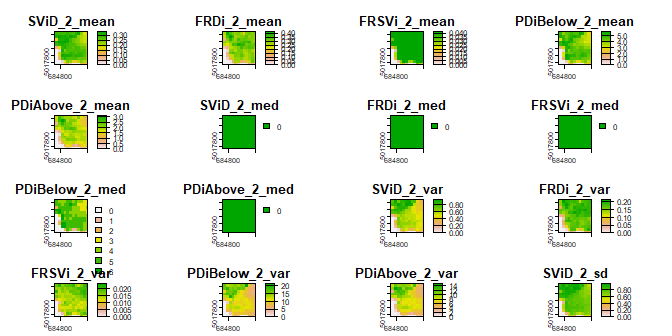
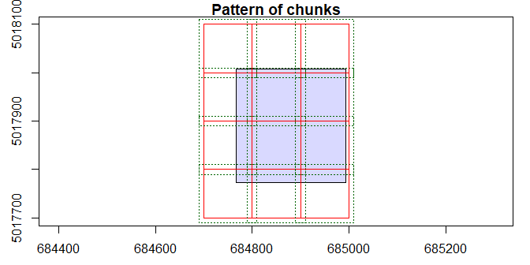
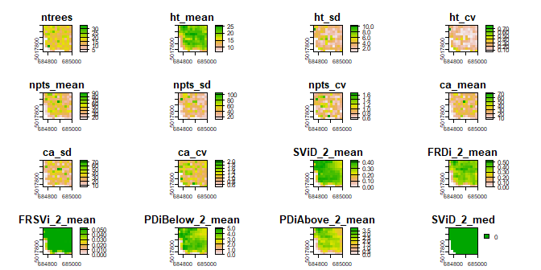

lidRattR
================

A package to be used in conjuction with lidR
(<https://github.com/Jean-Romain/lidR>) that produces area-based
variables. Newer functions focus on the use of tree- and voxel-based
attributes. These approaches are further outlined in Blackburn et
al. 2021 (<https://cdnsciencepub.com/doi/10.1139/cjfr-2020-0506>). Below
are some examples:

### Install package

``` r
# devtools::install_github("RCBlackburn/lidRattR")
```

### Load in library and example data from lidR package

``` r
library(lidR)
library(lidRattR)
library(data.table)
library(terra)
```

    ## terra 1.7.71

    ## 
    ## Attaching package: 'terra'

    ## The following object is masked from 'package:data.table':
    ## 
    ##     shift

    ## The following objects are masked from 'package:lidR':
    ## 
    ##     area, crs, crs<-, is.empty

    ## The following object is masked from 'package:knitr':
    ## 
    ##     spin

``` r
LASfile <- system.file("extdata", "Megaplot.laz", package="lidR")
las <- readLAS(LASfile)
las <- filter_poi(las, Classification != LASNOISE)
las <- normalize_height(las, knnidw(k = 8, p = 2))
las <- filter_poi(las, Z < 50 & Z >= 1.37 )
las <- decimate_points(las, random_per_voxel(res = 1, n = 8))
```

## Tree-based approach

<p align="center">

</p>

The tree based approach summarizes individual tree based information to
a given area (e.g., plot, pixel).

First, We segment the trees using a tree segmentation function from
lidR. Here, we use the Li et al. 2012 algorithm.

``` r
las_tree <- segment_trees(las, li2012())
plot(las_tree, color = "treeID")
```

<p align="center">

</p>

Next, we can turn the segmented tree point cloud into a summary
statistics of tree attributes to either the extent of the point cloud or
within individual raster cells (resolution defined by rast_res).

``` r
## entire las summary statistics 
tree_metrics <- tree_summary(las_tree)
kable(tree_metrics)
```

| ntrees |  ht_mean |    ht_sd |     ht_cv | npts_mean |  npts_sd |   npts_cv |  ca_mean |    ca_sd |    ca_cv |
|-------:|---------:|---------:|----------:|----------:|---------:|----------:|---------:|---------:|---------:|
|   1866 | 19.52982 | 4.627504 | 0.2369456 |  37.53537 | 36.59828 | 0.9750344 | 22.88076 | 28.01921 | 1.224575 |

``` r
## rasterized summary statistics 
tree_metrics <- tree_raster(las_tree, rast_res = 20)
plot(tree_metrics)
```

<!-- -->

## Voxel-based approach

<p align="center">

</p>

The voxel-based approach voxelizes the point cloud and summarizes voxel
information across a given area. This allows voxel-based variables to be
assessed using an area-based approach.

Using these functions, we produce summary statistics of voxel attributes
to either the entire las or within individual raster cells (resolution
defined by rast_res). These attributes can be computed without defining
a specified maximum height for the analysis (max_z = NULL) or setting a
maximum height that must be larger than the highest Z value in the study
area. Applicability of certain voxel attributes depends on raster and
voxel resolution.

``` r
## entire las summary statistics 
voxel_metrics <- voxel_summary(las, vox_res = 2, max_z = 50)
kable(voxel_metrics)
```

| SViD_2_mean | FRDi_2_mean | FRSVi_2_mean | PDiBelow_2_mean | PDiAbove_2_mean | SViD_2_med | FRDi_2_med | FRSVi_2_med | PDiBelow_2_med | PDiAbove_2_med | SViD_2_var | FRDi_2_var | FRSVi_2_var | PDiBelow_2_var | PDiAbove_2_var | SViD_2_sd | FRDi_2_sd | FRSVi_2_sd | PDiBelow_2_sd | PDiAbove_2_sd | SViD_2_cv | FRDi_2_cv | FRSVi_2_cv | PDiBelow_2_cv | PDiAbove_2_cv | SViD_2_IQR | FRDi_2_IQR | FRSVi_2_IQR | PDiBelow_2_IQR | PDiAbove_2_IQR | SViD_2_skew | FRDi_2_skew | FRSVi_2_skew | PDiBelow_2_skew | PDiAbove_2_skew | SViD_2_kurt | FRDi_2_kurt | FRSVi_2_kurt | PDiBelow_2_kurt | PDiAbove_2_kurt | pct_fill_vox_2 | SVsum_2_mean | SVMmdAbove_2_mean | SVMmd_2_mean | SVsum_2_med | SVMmdAbove_2_med | SVMmd_2_med | SVsum_2_var | SVMmdAbove_2_var | SVMmd_2_var | SVsum_2_sd | SVMmdAbove_2_sd | SVMmd_2_sd | SVsum_2_cv | SVMmdAbove_2_cv | SVMmd_2_cv | SVsum_2_IQR | SVMmdAbove_2_IQR | SVMmd_2_IQR | SVsum_2_skew | SVMmdAbove_2_skew | SVMmd_2_skew | SVsum_2_kurt | SVMmdAbove_2_kurt | SVMmd_2_kurt |
|------------:|------------:|-------------:|----------------:|----------------:|-----------:|-----------:|------------:|---------------:|---------------:|-----------:|-----------:|------------:|---------------:|---------------:|----------:|----------:|-----------:|--------------:|--------------:|----------:|----------:|-----------:|--------------:|--------------:|-----------:|-----------:|------------:|---------------:|---------------:|------------:|------------:|-------------:|----------------:|----------------:|------------:|------------:|-------------:|----------------:|----------------:|---------------:|-------------:|------------------:|-------------:|------------:|-----------------:|------------:|------------:|-----------------:|------------:|-----------:|----------------:|-----------:|-----------:|----------------:|-----------:|------------:|-----------------:|------------:|-------------:|------------------:|-------------:|-------------:|------------------:|-------------:|
|   0.2273618 |   0.2410709 |    0.0359578 |        3.706962 |         1.52236 |          0 |          0 |           0 |              4 |              0 |  0.5158476 |  0.1550052 |   0.0137531 |       11.55918 |       7.026117 | 0.7182253 |  0.393707 |  0.1172738 |       3.39988 |      2.650682 |  3.158953 |  1.633159 |   3.261429 |     0.9171606 |      1.741167 |          0 |        0.5 |           0 |              6 |              3 |    4.027063 |    1.165128 |     4.273663 |       0.5108812 |        1.652124 |    22.31772 |    2.537385 |     24.47257 |        2.540443 |         4.95689 |          38375 |     5.456684 |          9.360538 |     13.87183 |           6 |             8.16 |       15.84 |    9.696012 |         91.70847 |     54.8267 |   3.113842 |        9.576454 |   7.404505 |  0.5706473 |        1.023067 |  0.5337799 |           3 |            19.02 |    10.04875 |    -0.002447 |         0.1984318 |   -0.6556199 |     3.202793 |          1.282539 |     2.334882 |

``` r
## rasterized summary statistics  
voxel_metrics <- voxel_raster(las, vox_res = 2, rast_res = 20, max_z = 50)
plot(voxel_metrics)
```

<!-- -->

## Catalog processing

Tree and voxel summaries can also be implemented using lidR’s catalog
processing engine:

``` r
## read in lidar catalog
LASfile <- system.file("extdata", "Megaplot.laz", package="lidR")
ctg = readLAScatalog(LASfile)

## set catlog options 
opt_chunk_buffer(ctg) <- 10 
opt_chunk_size(ctg) <- 100    
```

    ## Be careful, a chunk size smaller than 250 is likely to be irrelevant.

``` r
opt_select(ctg) <- "xyzicr"      
opt_wall_to_wall(ctg) <- TRUE
opt_chunk_alignment(ctg) <- c(0,0)
opt_progress(ctg) <- FALSE
opt_stop_early(ctg) <- TRUE

## check chunks and overlap
plot(ctg, chunk = TRUE)
```

<!-- -->

``` r
## define custom function for catalog processing 
all_layers_catalog = function(cluster)
{ 
  las = readLAS(cluster)
  las = las_update(las) 
  if (lidR::is.empty(las)) return(NULL) 
  las = filter_poi(las, Classification != LASNOISE)
  if (lidR::is.empty(las)) return(NULL)
  las = normalize_height(las, knnidw(k = 8, p = 2)) 
  las = filter_poi(las, Z < 49 & Z >= 1.37 ) 
  if (lidR::is.empty(las)) return(NULL)
  las <- decimate_points(las, random_per_voxel(res = 1, n = 8))
  if (lidR::is.empty(las)) return(NULL)
  
  vmetrics <-voxel_raster(las,vox_res = 2, rast_res = 20, max_z = 40)
  las <- segment_trees(las, li2012())
  tmetrics <-tree_raster(las, rast_res = 20)
  vmetrics <- resample(vmetrics,tmetrics)
  metrics <- c(tmetrics,vmetrics)
  tile0_ext = lidR::ext(las)
  vmetrics <- crop(metrics, tile0_ext)
  
  return(wrap(vmetrics))
}


layer_list <- catalog_apply(ctg, all_layers_catalog)

raster <- lapply(layer_list, terra::unwrap)
raster <- do.call(terra::merge, raster)

plot(raster)
```

<!-- -->
