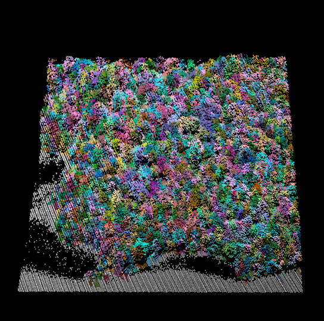

lidRattR
================

A package to be used in conjuction with lidR
(<https://github.com/Jean-Romain/lidR>) that produces area-based
varaibles. Newer function focus on the use of tree- and voxel-based
attributes. These appraoches are further outlined in Blackburn et
al. 2021 (<https://cdnsciencepub.com/doi/10.1139/cjfr-2020-0506>). Below
are some examples:

### Install package

``` r
# devtools::install_github("RCBlackburn/lidRattR")
```

### Load in library and example data from lidR package

``` r
library(lidR)
library(lidRattR)
LASfile <- system.file("extdata", "Megaplot.laz", package="lidR")
las <- readLAS(LASfile)
```

## Tree-based approach

<p align="center">

</p>

The tree based approach summarizes individual tree based information to
a given area (e.g., plot, pixel).

First, We segment the trees using a tree segmentation function from
lidR. Here, we use the Li et al. 2012 algorithm.

``` r
las_tree <- segment_trees(las, li2012())
plot(las_tree, color = "treeID")
```

<p align="center">

</p>

Next, we can turn the segmented tree point cloud into a tree attribute
point cloud that can be used to summarize attributes to different
extents.

``` r
las_tree <- ind_tree(las_tree)

## entire las summary statistics 
overall_t_metrics <- tree_sum(las_tree)
kable(overall_t_metrics)
```

| ntrees |  ht_mean |    ht_sd |     ht_cv | npts_mean |  npts_sd |   npts_cv |  ca_mean |    ca_sd |   ca_cv |
|-------:|---------:|---------:|----------:|----------:|---------:|----------:|---------:|---------:|--------:|
|   1903 | 19.31242 | 4.889603 | 0.2531844 |  39.67893 | 38.07634 | 0.9596112 | 23.25238 | 28.20956 | 1.21319 |

``` r
## rasterized summary statistics 
tree_metrics <- pixel_metrics(las_tree, tree_sum_raster(Z, npoints, ca), res = 20)

plot(tree_metrics)
```

<!-- -->

## Voxel-based approach

<p align="center">

</p>

The voxel-based approach voxelizes the point cloud and summarizes voxel
information across a given area. This allows voxel-based variables to be
assessed using an area-based approach.

Using these functions, We produce a voxelized point cloud with indivdual
voxel metrics and then summarize them to either the entire las or a
raster with defined spatial resolution.

``` r
las_vox <- ind_vox(las, res = 2)

## entire las summary statistics 
overall_v_metrics <- vox_sum(las_vox, 2)
kable(overall_v_metrics[c(1:4, 33)])
```

| SVi_2\_mean | FRDi_2\_mean | PDi_2\_mean | PDi_above_2\_mean | pct_fill_vox_2 |
|------------:|-------------:|------------:|------------------:|---------------:|
|   0.3790793 |     3.08e-05 |    3.171619 |           2.51457 |      0.2001375 |

``` r
## rasterized summary statistics  
v_metrics <- pixel_metrics(las_vox, func = vox_sum_raster(SVi_2, FRDi_2, PDi_2, PDi_above_2, vox_res = 2), res = 20)
plot(v_metrics)
```

<!-- -->
